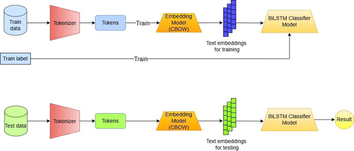

# Đồ án cuối kỳ Nhập môn xử lý ngôn ngữ tự nhiên
| MSSV | Thành viên |
|-|-|
|21120314| Hồ Lê Minh Quân |
|21120350| Nguyễn Quốc Trung|
|21120378| Đỗ Hữu Huy Hoàng|
|21120593| Võ Hoàng Hoa Viên|

## 1. Mục tiêu
Trong bối cảnh số hóa các tài liệu cổ và nghiên cứu lịch sử, việc phân loại tự động các văn bản chữ Hán và chữ Nôm có nhiệm vụ quan trọng. Điều này không chỉ giúp tự động hóa việc xử lý dữ liệu lớn mà còn hỗ trợ các chuyên gia trong việc tổ chức, phân tích, và bảo tồn di sản văn hóa.
Việc phân loại văn bản chữ Hán và chữ Nôm mang lại nhiều lợi ích, bao gồm:
- Giúp tách biệt và phân tích ngữ liệu chữ Hán và chữ Nôm trong các tài liệu cổ.
- Là bước đầu tiên để xây dựng các hệ thống OCR (nhận diện ký tự quang học), dịch tự động, hoặc tái tạo văn bản cổ.
- Góp phần bảo vệ các tài liệu cổ, giúp chúng dễ dàng được tiếp cận và hiểu rõ hơn bởi thế hệ sau.

## 2. Dữ liệu

### 2.1 Thu thập dữ liệu

Dữ liệu được thu thập từ nhiều nguồn khác nhau, bao gồm: 
- Số tác phẩm chữ Hán: 335 bài.
        - 334 bài văn vần: từ thivien.net.
        - Đại Việt sử ký toàn thư (văn xuôi): ngữ liệu do giảng viên cung cấp.
- Số tác phẩm chữ Nôm: 137 bài.
        - 132 bài văn vần, được lấy từ nomfoundation.org, chunom.org, ngữ liệu do giảng viên cung cấp.
        - 5 bài văn xuôi: ngữ liệu do giảng viên cung cấp.

### 2.2 Tiền xử lý dữ liệu
Do dữ liệu văn bản thuộc cả 2 hình thức là văn xuôi và văn vần nên cần những cách xử lý dữ liệu khác nhau. Với văn xuôi, dữ liệu được chia thành các câu dựa trên kí tự kết thúc câu (“.”, “!”, “?”), còn với văn vần (thơ), dữ liệu được chia thành các dòng dựa vào kí tự “\n”. 
Thống kê:
- Số câu/dòng văn bản Hán: 22815.
- Số câu/dòng văn bản Nôm: 53876.
Trong thực tế, bài toán yêu cầu đơn vị của dữ liệu đầu vào là các đoạn văn bản chứa số lượng câu/dòng chưa biết trước, vì vậy cần mô phỏng lại dữ liệu đầu vào trong bộ dữ liệu huấn luyện bằng cách nhóm các câu/dòng thành đoạn văn bản. Việc này được thực hiện thông qua thuật toán Partitioner được nhóm thiết kế.

## 3. Phương pháp
### 3.1 Tổng quan


Quá trình tạo ra bộ phân loại văn bản Hán/Nôm gồm 2 giai đoạn: huấn luyện (training) và kiểm thử (testing). Có 3 module chính:
- Tokenizer: chia nhỏ dữ liệu đầu vào (đoạn văn bản) thành các đơn vị nhỏ hơn (token). Với văn bản Hán/Nôm, đơn vị token được sử dụng là đơn vị ký tự (character).
- Embedding model: chuyển token thành các embedding vector. Mô hình được sử dụng là CBOW (Continuous Bag of Words).
- Classifier: nhận vào danh sách embedding vector cho các token và trả ra kết quả phân loại bộ ký tự của văn bản (Hán/Nôm).
Để đảm bảo tính tổng quát hóa của mô hình, pipeline thực hiện kiểm chứng chéo (cross-validation) 5-fold trên tập dữ liệu. Quá trình này được thực hiện như sau:
- Phân đoạn dữ liệu:
        - Toàn bộ tập dữ liệu được chia thành 5 phần (fold) bằng nhau.
        - Trong mỗi lần lặp, 4 phần sẽ được sử dụng làm dữ liệu huấn luyện, phần còn lại làm dữ liệu kiểm thử.
- Đánh giá kết quả:
        - Mô hình được đánh giá trên cả 5 fold, sau đó tính toán độ chính xác trung bình trên tất cả các lần lặp. Điều này giúp giảm thiểu hiện tượng overfitting và đánh giá chính xác hiệu suất mô hình trên các tập dữ liệu chưa từng thấy trước đó.


### 3.2 Xây dựng mô hình embeddings
Module Embedding Model chuyển đổi danh sách các token thành các embedding vector sử dụng loại mô hình FastText trong thư viện Gensim với kiến trúc được sử dụng là CBOW (Continuous Bag of Words).

### 3.3 Xây dựng mô hình classifier
```py
model = Sequential()
        model.add(Embedding(self.vocab_size, self.config.embedding_size, weights=[self.embedding_matrix], 
                            input_length=self.config.maxlen, trainable=False))
        model.add(Bidirectional(LSTM(self.config.LSTM_output_size)))
        model.add(Dense(1, activation='sigmoid'))
        model.compile(optimizer='adam', loss=self.config.loss, metrics=['acc'])
```

## 4. Kết quả
Để đảm bảo cách phân chia câu và đoạn không quá ảnh hưởng tới kết quả huấn luyện, nhóm đã sử dụng thuật toán Partitioner 5 lần để có được 5 bộ dữ liệu có sự phân chia đoạn khác nhau, và thực hiện lại toàn bộ phương pháp được trình bày trên 5 bộ dữ liệu này. Kết quả trung bình thực hiện kiểm chứng chéo (cross-validation) 5-fold của mỗi bộ dữ liệu được trình bày trong bảng sau:

|     Corpus              |     Accuracy    |     F1 Score    |     Precision    |     Recall    |     Mean Binary Error    |
|-------------------------|-----------------|-----------------|------------------|---------------|--------------------------|
|     polysen_corpus_0    |     0.993       |     0.995       |     0.996        |     0.993     |     0.007                |
|     polysen_corpus_1    |     0.992       |     0.994       |     0.996        |     0.992     |     0.008                |
|     polysen_corpus_2    |     0.993       |     0.995       |     0.995        |     0.994     |     0.007                |
|     polysen_corpus_3    |     0.994       |     0.996       |     0.998        |     0.994     |     0.006                |
|     polysen_corpus_4    |     0.993       |     0.995       |     0.997        |     0.992     |     0.007                |
|     Average             |     0.993       |     0.995       |     0.996        |     0.993     |     0.007                |


## 5. Hướng dẫn chạy
### 5.1 Huấn luyện, chia dữ liệu và xem kết quả
```
pip install -r requirements.txt
cd scripts
python main.py
```
### 5.2 Dự đoán cho một văn bản (câu hoặc đoạn)
```
pip install -r requirements.txt
cd scripts
python inference.py
```
