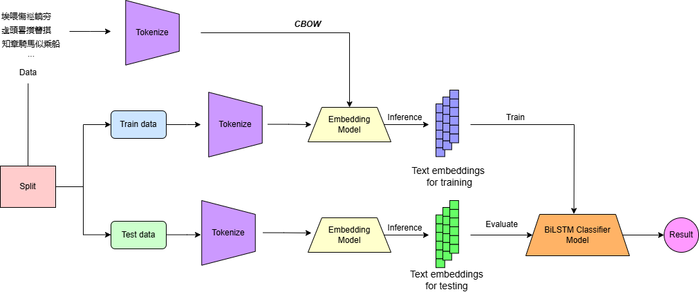

# Đồ án cuối kỳ Nhập môn xử lý ngôn ngữ tự nhiên
| MSSV | Thành viên |
|-|-|
|21120314| Hồ Lê Minh Quân |
|21120350| Nguyễn Quốc Trung|
|21120378| Đỗ Hữu Huy Hoàng|
|21120593| Võ Hoàng Hoa Viên|

## 1. Mục tiêu
- Xây dựng mô hình phân biệt chữ Hán và chữ Nôm.
- Input: 1 câu chữ Hán hoặc chữ Nôm.
- Output: 1 (chữ Nôm) hoặc 0 (chữ Hán).

## 2. Phương pháp


Giai đoạn đầu, dữ liệu được xử lý qua bước Tokenize, nơi các câu được tách thành các từ. Sau đó đưa vào mô hình CBOW để tạo Embedding Model để học word embeddings. Giai đoạn tiếp theo, chia dữ liệu thành hai phần: dữ liệu huấn luyện (Train data) và dữ liệu kiểm thử (Test data). Embeddings từ dữ liệu huấn luyện được sử dụng để huấn luyện mô hình phân loại BiLSTM, và embeddings từ dữ liệu kiểm thử được dùng để đánh giá hiệu quả của mô hình thông qua các tiêu chí như độ chính xác hoặc F1-score. 

### 2.1 Thu thập dữ liệu
Dữ liệu được thu thập từ nhiều nguồn khác nhau, bao gồm: 
- Tác phẩm thơ chữ Hán: thivien.net
- Tác phẩm thơ chữ Nôm: nomfoundation.org
- Ngữ liệu được giảng viên giao.

### 2.2 Xây dựng mô hình embeddings
Để xây dựng mô hình embeddings, dữ liệu được tiền xử lý và chuyển đổi thành các chuỗi ký tự hoặc từ đã tokenize. Quá trình này bao gồm việc loại bỏ các ký tự không thuộc bộ ký tự chữ Hán hoặc chữ Nôm, chuẩn hóa văn bản và tách từ. 

Sau đó thực hiện train mô hình tạo embeddings với các tham số như sau:
```py
embedding_model.train(tokenized_lines = tokenized_lines,
                            window = 10,
                            vector_size = 300,
                            min_count = 1,
                            sg=0,
                            epochs=50,
                            model_type="FastText",
                            verbose=True
)
```

### 2.3 Xây dựng mô hình phân biệt
Mô hình phân biệt được xây dựng dựa trên kiến trúc BiLSTM. Các vector embeddings được tạo từ mô hình embeddings ở bước trước sẽ được sử dụng làm đầu vào cho mô hình BiLSTM.
```py
model = Sequential()
        model.add(Embedding(self.vocab_size, self.config.embedding_size, weights=[self.embedding_matrix], 
                            input_length=self.config.maxlen, trainable=False))
        model.add(Bidirectional(LSTM(self.config.LSTM_output_size)))
        model.add(Dense(1, activation='sigmoid'))
        model.compile(optimizer='adam', loss=self.config.loss, metrics=['acc'])
```

## 3. Kết quả
Sau khi huấn luyện, mô hình sẽ được kiểm thử trên dữ liệu kiểm thử để đánh giá hiệu quả.

| Mô hình | Acc | Precision | Recall | F1 |
|-|-|-|-|-|
|BiLSTM| 0.98 |0.97|0.97|0.97|
|| ||||
|| ||||
|| ||||

## 4. Hướng dẫn chạy
> Chạy file embedding/train.py để tạo model embedding.
> Chạy file model/train_classifer.py để tạo model phân biệt.
